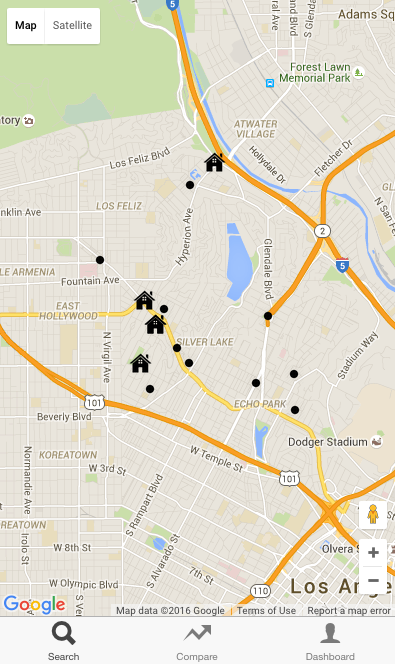
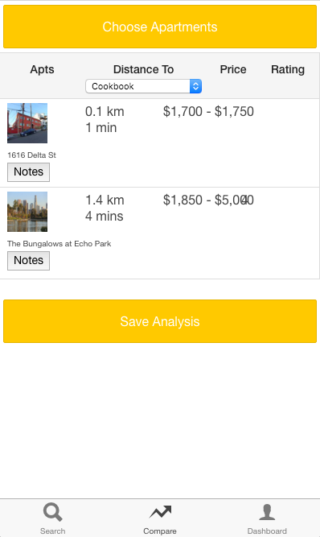

# 
<h4>WELIVE LA is mobile-based application that lets you search apartments and browse local businesses at the same time.</h4>
- Search apartments and see what points of interest are near by<br>
- Save apartments and compare them by different criteria, including the price, distance to the points of interest and yelp rating<br>
- Make notes on the saved apartments

##Technologies
```
Ionic
AngularJS
NodeJS
MongoDB
ExpressJS
Mongoose
```

##External Data Sources
```
GoogleMaps API + Geocoder + Distance Service
Yelp API
Apartments.com
```

##Dependencies
<h4>Server-Side</h4>
```
bcrypt
cheerio
cors
express
jsonwebtoken
request-promise
yelp(npm)
mongoose
morgan
body-parser
``` 
<h4>Client-Side</h4>
``` 
bower
gulp
gulp-sass
bower
cordova-plugin-inappbrowser
cordova-plugin-whitelist
``` 
##Installation
<h4> Server-Side</h4>
```
$ npm install
```

<h4>Client-Side</h4>
```
$ npm install -g cordova ionic
$ npm install -g bower
```

##Links
<div><a target="_blank" href="https://trello.com/b/LcU2f6lW/project-4-welive-la">Trello Board</a></div>
<div><a target="_blank" href="http://welivelav3.s3-website-us-west-2.amazonaws.com/">Deployed Client</a></div>

##Screen Shots



##Next Steps
- Optimize UI on mobile
- Refactor code to keep things DRY
- Apply single responsibility concepts
- Let users select critera for apartment comparison
- Add apartment filters

